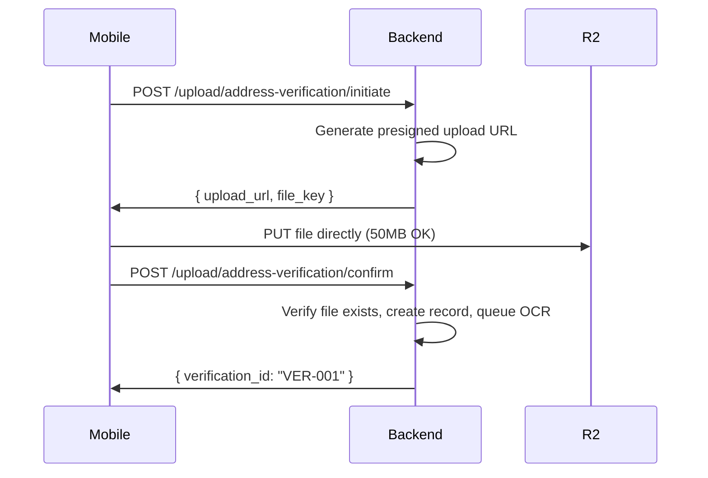

# Address Verification System - Implementation Plan

## Requirements Summary

| Requirement | Implementation |
|-------------|----------------|
| Keep existing `address_link` column | Store R2 file key, generate presigned URLs on-demand |
| Document types | `utility_bill`, `bank_statement` |
| OCR provider | Google Cloud Vision API |
| Upload method | Direct-to-R2 (bypasses hosting limits) |
| Security | Private R2 bucket + presigned URLs (1 hour expiry) |
| Compliance checks | Name match, address match, document expired, readable, altered |
| Timezone | Store UTC, display per country (NG, GH, KE, ZA) |
| Verification page | Separate sidebar link (not nested under Customers) |
| Role access | Owner, Admin, Operations, CustomerSupport can approve/decline |

---

## File Size & Type Limits

| Upload Type | Min | Max | Allowed Types |
|-------------|-----|-----|---------------|
| **Address Verification** | 5 KB | 50 MB | jpeg, png, webp, pdf |
| **Profile Avatars** | 1 KB | 5 MB | jpeg, png, webp |
| **Transaction Receipts** | - | 10 MB | pdf |

---

## Phase 1: Cloudflare R2 Integration

### 1.1 Install Packages

```bash
npm install @aws-sdk/client-s3 @aws-sdk/s3-request-presigner @google-cloud/vision
npm install -D @types/multer
```

### 1.2 Environment Config

#### [MODIFY] `src/config/env.ts`

```typescript
cloudflareR2: {
  accountId: process.env.CLOUDFLARE_ACCOUNT_ID,
  accessKeyId: process.env.CLOUDFLARE_R2_ACCESS_KEY_ID,
  secretAccessKey: process.env.CLOUDFLARE_R2_SECRET_ACCESS_KEY,
  bucketName: process.env.CLOUDFLARE_R2_BUCKET_NAME || 'spendease-documents'
},
googleCloud: {
  visionApiKey: process.env.GOOGLE_CLOUD_VISION_API_KEY
}
```

### 1.3 R2 Storage Service

#### [NEW] `src/integrations/cloudflare-r2.ts`

Functions:
- `getPresignedUploadUrl(key, expiresIn)` - For direct uploads
- `getPresignedDownloadUrl(key, expiresIn)` - For viewing documents
- `deleteFile(key)` - Delete from bucket
- `checkFileExists(key)` - Verify upload completed

Storage paths:
```
documents/{user_id}/address-verification/{uuid}-{timestamp}.{ext}
documents/{user_id}/receipts/{transaction_id}/{uuid}.pdf
avatars/{user_id}/{uuid}.{ext}
```

---

## Phase 2: Centralized Upload API

### 2.1 Route Structure

```
/api/v1/upload/
├── /address-verification/initiate   # Get presigned upload URL
├── /address-verification/confirm    # Confirm upload, queue OCR
├── /avatar/initiate                  # Get presigned upload URL
├── /avatar/confirm                   # Confirm upload
├── /receipts                         # System use only
└── /presigned-url                    # Get download URL (admin)
```

### 2.2 Direct Upload Flow (Bypasses Hosting Limits)



### 2.3 Rate Limits

| Endpoint | Limit | Window |
|----------|-------|--------|
| `/upload/address-verification/*` | 5 | 1 hour |
| `/upload/avatar/*` | 10 | 1 hour |
| `/upload/presigned-url` | 20 | 1 minute |

### 2.4 New Files

#### [NEW] `src/api/v1/routes/upload.ts`
#### [NEW] `src/controllers/upload.ts`
#### [NEW] `src/validations/upload.ts`

---

## Phase 3: Database Models

### 3.1 Address Verification Requests

#### [NEW] `src/database/migrations/YYYYMMDDHHMMSS-create-address-verification-requests.js`

| Column | Type | Description |
|--------|------|-------------|
| id | INTEGER | Primary key |
| reference | STRING | Unique (VER-XXXXX) |
| user_id | INTEGER | FK to users |
| document_type | ENUM | 'utility_bill', 'bank_statement' |
| file_key | STRING | R2 object key |
| original_filename | STRING | User's filename |
| file_size | INTEGER | Bytes |
| status | ENUM | 'pending_ocr', 'pending_review', 'approved', 'declined' |
| ocr_data | JSON | Raw OCR results |
| extracted_name | STRING | OCR extracted |
| extracted_address | STRING | OCR extracted |
| name_match_score | FLOAT | 0-100 |
| address_match_score | FLOAT | 0-100 |
| compliance_checks | JSON | { name_match, address_match, document_expired, document_readable, document_altered } |
| risk_level | ENUM | 'low', 'medium', 'high' |
| decline_reason | ENUM | 'document_expired', 'document_unreadable', 'address_mismatch', 'name_mismatch', 'document_altered' |
| reviewer_id | INTEGER | Admin FK |
| review_notes | TEXT | |
| reviewed_at | DATETIME | |
| created_at, updated_at | DATETIME | UTC |

### 3.2 Verification Timeline

#### [NEW] `src/database/migrations/YYYYMMDDHHMMSS-create-verification-timeline.js`

| Column | Type | Description |
|--------|------|-------------|
| id | INTEGER | Primary key |
| verification_request_id | INTEGER | FK |
| event_type | ENUM | 'submitted', 'ocr_started', 'ocr_completed', 'auto_approved', 'approved', 'declined', 'resubmitted' |
| actor_type | ENUM | 'system', 'admin', 'user' |
| actor_id | INTEGER | Nullable |
| details | JSON | Event data |
| created_at | DATETIME | UTC |

### 3.3 Model Files

#### [NEW] `src/database/models/address-verification-request.ts`
#### [NEW] `src/database/models/verification-timeline.ts`
#### [NEW] `src/database/repositories/address-verification.ts`
#### [NEW] `src/interfaces/address-verification.ts`

---

## Phase 4: Google Cloud Vision OCR

### 4.1 OCR Integration

#### [NEW] `src/integrations/google-vision.ts`

Functions:
- `extractTextFromImage(imageUrl)` - Full text extraction
- `extractDocumentData(text)` - Parse name/address from text

### 4.2 Bull Queue Job

#### [NEW] `src/jobs/processors/ocr-processing.ts`

**Auto-approval logic:**
- If `name_match_score >= 85` AND `address_match_score >= 85` → Auto-approve
- Otherwise → Set to `pending_review` for manual review

> **NOTE:** The 85% threshold accounts for OCR misreads and formatting differences. Scores below 85% don't mean rejection - they go to manual review where admin can visually compare and approve.

### 4.3 Compliance Checks

| Check | Method |
|-------|--------|
| Name Match | `validateIdentitySimilarity()` (existing helper) |
| Address Match | Same helper |
| Document Expired | Parse date, check if > 3 months old |
| Document Readable | Vision API confidence > 70% |
| Document Altered | Vision API authenticity flags |

---

## Phase 5: Admin API

### 5.1 Endpoints

#### [NEW] `src/api/admin-routes/address-verification.ts`

| Method | Endpoint | Purpose | Roles |
|--------|----------|---------|-------|
| GET | `/queue` | List with filters | All |
| GET | `/stats` | Dashboard stats | All |
| GET | `/:id` | Detail + presigned URL | All |
| GET | `/:id/timeline` | Audit trail | All |
| PATCH | `/:id/approve` | Approve | Owner, Admin, Ops, Support |
| PATCH | `/:id/decline` | Decline with reason | Owner, Admin, Ops, Support |

### 5.2 Update Access Matrix

#### [MODIFY] `src/constants/admin-access.ts`

Add `AddressVerification` module with Full access for Owner, Admin, Operations, CustomerSupport.

### 5.3 Update Audit Log Events

#### [MODIFY] `src/constants/audit-log.ts`

```typescript
AddressVerificationSubmitted = 'address_verification_submitted',
AddressVerificationAutoApproved = 'address_verification_auto_approved',
AddressVerificationApproved = 'address_verification_approved',
AddressVerificationDeclined = 'address_verification_declined'

// Add System actor
export enum AuditLogActor {
  Admin = 'admin',
  User = 'user',
  System = 'system'
}
```

---

## Phase 6: Email Templates

### 6.1 New Templates

| Template | Recipient | Trigger |
|----------|-----------|---------|
| `address-verification-approved.tsx` | User | Approval (OCR or manual) |
| `address-verification-declined.tsx` | User | Decline with reason |
| `address-verification-admin-alert.tsx` | support@myspendease.com | OCR result (auto-approved or needs review) |

#### [NEW] `src/templates/address-verification-approved.tsx`
#### [NEW] `src/templates/address-verification-declined.tsx`
#### [NEW] `src/templates/address-verification-admin-alert.tsx`

---

## Phase 7: Admin Frontend

### 7.1 Sidebar Update

#### [MODIFY] Sidebar items

Add "Verification" as **separate link** (same level as Customers, Transactions):

```typescript
{
  title: "Verification",
  url: "/dashboard/verification",
  icon: ShieldCheck,
  isNew: true
}
```

### 7.2 New Pages

#### [NEW] `src/app/(main)/dashboard/verification/page.tsx`
- Stats cards: In Queue, Needs Review, Approved Today, Declined Today
- Queue table with filters
- Quick actions

#### [NEW] `src/app/(main)/dashboard/verification/[id]/page.tsx`
- 4 tabs: Documents, Address Comparison, Compliance Checks, Review History
- Document viewer (uses presigned URL)
- Approve/Decline actions

### 7.3 Components

```
src/app/(main)/dashboard/verification/
├── page.tsx
├── [id]/page.tsx
└── _components/
    ├── verification-stats.tsx
    ├── verification-table.tsx
    ├── document-viewer.tsx
    ├── address-comparison.tsx
    ├── compliance-checks.tsx
    ├── timeline.tsx
    ├── approve-dialog.tsx
    └── decline-dialog.tsx
```

### 7.4 Timezone Display

| Country | Timezone | Abbrev |
|---------|----------|--------|
| Nigeria | Africa/Lagos | WAT (UTC+1) |
| Ghana | Africa/Accra | GMT (UTC+0) |
| Kenya | Africa/Nairobi | EAT (UTC+3) |
| South Africa | Africa/Johannesburg | SAST (UTC+2) |

Display: "Jan 25, 2026, 10:30 AM (WAT)"

### 7.5 Server Actions

#### [NEW] `src/app/actions/address-verification.ts`

---

## Files Summary

### Backend - New (18 files)

| Category | Files |
|----------|-------|
| **Integrations** | `cloudflare-r2.ts`, `google-vision.ts` |
| **Upload API** | `routes/upload.ts`, `controllers/upload.ts`, `validations/upload.ts` |
| **Database** | 2 migrations, 2 models, 1 repository, 1 interface |
| **OCR** | `jobs/processors/ocr-processing.ts` |
| **Admin API** | `admin-routes/address-verification.ts`, `controllers/admin/address-verification.ts`, `validations/address-verification.ts` |
| **Email** | 3 templates |

### Backend - Modified (5 files)

| File | Changes |
|------|---------|
| `config/env.ts` | Add R2, Google Cloud config |
| `constants/admin-access.ts` | Add AddressVerification module |
| `constants/audit-log.ts` | Add events, System actor |
| `api/v1/routes/index.ts` | Register upload routes |
| `api/admin-routes/index.ts` | Register verification routes |

### Frontend - New (11 files)

| Category | Files |
|----------|-------|
| **Pages** | `verification/page.tsx`, `verification/[id]/page.tsx` |
| **Components** | 8 components in `_components/` |
| **Actions** | `actions/address-verification.ts` |

### Frontend - Modified (2 files)

| File | Changes |
|------|---------|
| Sidebar items | Add Verification link |
| `lib/types.ts` | Add verification types |

---

## Verification Steps

### Phase 1-2: R2 & Upload API
1. Configure R2 bucket and credentials
2. Test presigned upload URL generation
3. Test direct upload from Postman
4. Verify file appears in R2

### Phase 3-4: Database & OCR
1. Run migrations
2. Upload test document
3. Check Bull queue processes job
4. Verify OCR data in database

### Phase 5: Admin API
1. Test queue endpoint returns data
2. Test approve/decline updates status
3. Check audit log entries

### Phase 6: Email
1. Trigger approval → check user email
2. Trigger decline → check user email with reason
3. Check admin alert at support@myspendease.com

### Phase 7: Frontend
1. Navigate to `/dashboard/verification`
2. View verification detail
3. Test approve/decline flows
4. Verify timeline with correct timezones

---

## Estimated Timeline

| Phase | Duration |
|-------|----------|
| 1. R2 Integration | 1-2 days |
| 2. Upload API | 1-2 days |
| 3. Database Models | 1 day |
| 4. OCR Processing | 2-3 days |
| 5. Admin API | 2 days |
| 6. Email Templates | 1 day |
| 7. Admin Frontend | 3-4 days |
| Integration & Testing | 2-3 days |

**Total: ~14-18 days**
